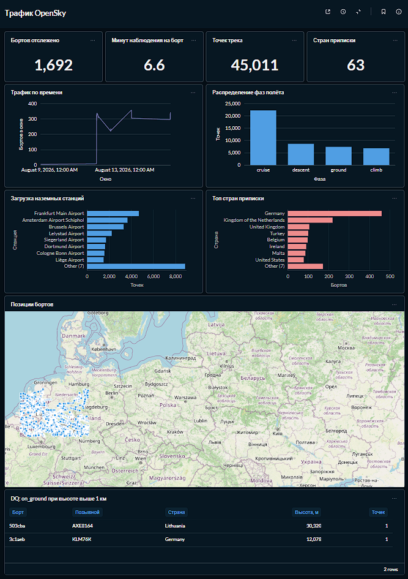

# Flight Tracking ETL

Инкрементальный ETL-пайплайн: собирает реальные ADS-B треки воздушных судов из
[OpenSky Network](https://opensky-network.org/), считает по ним телеметрию и
раскладывает в аналитическое хранилище.

## Дашборд



Витрина в Metabase поверх ClickHouse: KPI прогона, карта позиций бортов,
распределение фаз полёта, трафик по минутным окнам, разрезы по странам
приписки и наземным станциям. Отдельным блоком — контроль качества: борта,
у которых ADS-B отдал признак «на земле» при высоте в километры.

## Стек

- **Docker Compose** — весь стенд поднимается одной командой
- **Airflow 2.10.5** (CeleryExecutor) — оркестрация
- **Apache Spark** (local\[\*\], через `SparkSubmitOperator`) — трансформация и DQ
- **PostgreSQL** — метаданные Airflow + измерения DWH (SCD1 / SCD2)
- **ClickHouse** — таблица фактов, словари и витрины
- **MinIO** — S3-совместимое хранилище
- **Metabase** — визуализация
- **Redis** — брокер Celery

## Пайплайн `flight_pipeline`

```
extract_stations ─┐
                  ├─> convert_to_parquet ─> spark_transform_data ─> upload_curated_to_s3 ─> telegram
extract_states  ──┘
```

1. **`extract_stations`** — тянет `airports.csv` из OurAirports, оставляет крупные
   и средние аэропорты внутри bbox → `stations.csv`.
2. **`extract_states`** — опрашивает `/states/all` серией снапшотов. Один запрос —
   мгновенный срез всех бортов в bbox; трек борта собирается из последовательности
   срезов. По умолчанию 30 минут с шагом 20 с → `states.csv`.
3. **`convert_to_parquet`** — CSV → Parquet в партицию `date={{ ds }}`.
4. **`spark_transform_data`** — Source DQ → очистка → расчёт телеметрии → поиск
   ближайшей станции → Target DQ → запись в Postgres, ClickHouse и Parquet.
5. **`upload_curated_to_s3`** — выгрузка в MinIO готового к анализу слоя
   (curated): очищенные и обогащённые данные, в отличие от сырых CSV с шага 2.
6. **Telegram** — алерт об успехе или падении.

### Что считает трансформация

- **ECEF** (`x/y/z`) из geodetic по эллипсоиду WGS-84.
- **Число Маха** — через скорость звука по модели стандартной атмосферы (ISA).
- **Ближайшая станция** — broadcast-джойн точек со справочником станций и ранжирование
  по ECEF-расстоянию.
- **Фаза полёта** — `ground` / `climb` / `cruise` / `descent` по `on_ground` и
  `vertical_rate` (порог 2.5 м/с гасит шум ADS-B на эшелоне).

### Модель данных

**Postgres — измерения**

- `dim_flight` — борта, SCD1, ключ `icao24`
- `dim_station` — наземные станции, SCD2 с историей изменений

**ClickHouse — факты и витрины**

- `fact_flight_points` — точки треков, `ReplacingMergeTree`, TTL 1 год
- `flight_points_detailed` — OBT: факты, обогащённые словарями из Postgres
- `flights_agg` — агрегат по бортам за прогон
- `time_agg` — агрегат по минутным окнам и фазам полёта

### Настройка опроса

Меняется через Airflow Variables, без пересборки:

- `OPENSKY_BBOX` — зона наблюдения, JSON с границами
- `OPENSKY_WINDOW_SEC` — длительность окна опроса, по умолчанию `1800`
- `OPENSKY_INTERVAL_SEC` — пауза между запросами, по умолчанию `20`

Окно подобрано под время пересечения зоны: борт на крейсере проходит её примерно
за полчаса. Пайплайн работает с OpenSky анонимно — это 400 кредитов в сутки,
прогон тратит `WINDOW / INTERVAL` запросов.

## Запуск

1. Создать `.env` в корне по образцу [.env.example](.env.example), дописав
   `FERNET_KEY`, а также token и chat_id от BotFather.

`FERNET_KEY` — ключ, которым Airflow шифрует пароли и токены в своей БД. Менять
после первого запуска нельзя: сохранённые Connections перестанут расшифровываться.

```bash
python -c "from cryptography.fernet import Fernet; print(Fernet.generate_key().decode())"
```

2. Положить JDBC-драйверы в `./jars`:

```bash
mkdir -p jars && cd jars
curl -sLO https://jdbc.postgresql.org/download/postgresql-42.7.5.jar
curl -sLO https://repo1.maven.org/maven2/com/clickhouse/clickhouse-jdbc/0.9.7/clickhouse-jdbc-0.9.7-all.jar
curl -sLO https://repo1.maven.org/maven2/org/apache/hadoop/hadoop-aws/3.3.4/hadoop-aws-3.3.4.jar
curl -sLO https://repo1.maven.org/maven2/com/amazonaws/aws-java-sdk-bundle/1.12.262/aws-java-sdk-bundle-1.12.262.jar
```

3. Поднять стенд:

```bash
docker compose up -d --build
```

Схема БД создаётся только на пустых томах, так что после правок в
`src/init_db/` или `clickhouse/init/` её нужно пересоздать:

```bash
docker compose down -v
```

Ключ `-v` удаляет тома вместе с данными. Metabase держит дашборды и свои
настройки в Postgres, поэтому они пропадут вместе со схемой, и собирать их
придётся заново. Собранные треки тоже не восстановить — у OpenSky нет
исторического эндпоинта.

## Сервисы

- **Airflow** — http://localhost:8080, вход `admin` / `admin`
- **Metabase** — http://localhost:3001, учётка задаётся при первом входе
- **MinIO Console** — http://localhost:9006, креды из `.env`
- **ClickHouse** — http://localhost:8123, native-протокол на порту 9000
- **PostgreSQL** — порт 5432, креды из `.env`

## Структура

```
.
├── airflow_dockerfile/   # образ Airflow (+ JRE для spark-submit)
├── clickhouse/init/      # DDL: факты, словари, витрины
├── dags/                 # flight_pipeline
├── jars/                 # JDBC-драйверы
├── plugins/              # плагины Airflow
├── scripts/
│   ├── extract/          # OpenSky + OurAirports
│   └── transform/        # Spark-трансформация и DQ
└── src/init_db/          # DDL Postgres: измерения
```

